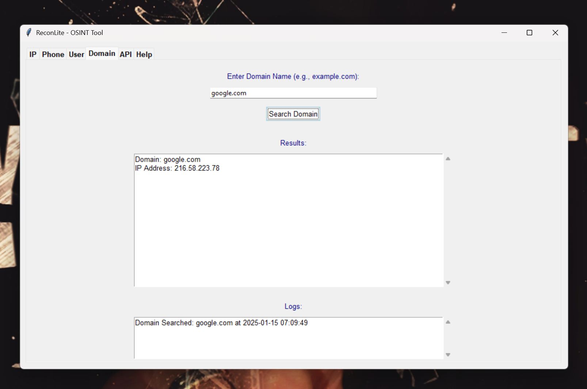

# ReconLite - An OSINT Tool for IP, Phone, Username, and Domain Searches

ReconLite is a user-friendly Open Source Intelligence (OSINT) tool designed for quick and easy searches across various data types including IP addresses, phone numbers, usernames, and domain names. This tool uses Python with a Tkinter GUI to provide an intuitive interface for users.

## # Features

- **IP Search**: Retrieve geographical and network information for an IP address.
- **Phone Number Search**: Identify the carrier and possible location of a phone number.
- **Username Search**: Check the availability of a username across multiple social media platforms.
- **Domain Search**: Perform DNS lookup for domain names.
- **API Key Management**: Securely save and manage API keys for enhanced functionality.
- **Automatic Result Saving**: All searches are automatically logged and saved in an SQLite database for later reference.

## # Installation

### # Prerequisites

- Python 3.x
- `pip` installed for package management

### # Required Libraries

Install the following Python packages:

pip install phonenumbers requests

# Clone the Repository
bash
git clone https://github.com/yourusername/ReconLite.git
cd ReconLite

# Usage
# Running the Application
Navigate to the directory containing ReconLite.py.
Run the script:

bash
python ReconLite.py

# Using the Interface
IP Tab: Enter an IP address to search for location and network details.
Phone Tab: Input a phone number in international format for carrier and location information.
User Tab: Type a username to check its presence on social media.
Domain Tab: Enter a domain name to find associated IP addresses.
API Tab: Manage your API keys here. You can save or edit the IPWhois API key for enhanced data retrieval.
Help Tab: Provides detailed usage information on each feature.

# Notes on Usage
API Key: While some features don't require an API key, for full functionality, particularly with IP searches, you'll need an API key from IPWhois. You can enter this in the 'API' tab.
Data Privacy: Be cautious with the information you search; ensure compliance with local laws regarding data use.

# Database
ReconLite uses SQLite for storing search results and API keys.
The database file (reconlite.db) is created in the same directory as the script upon first run.

# Contribution
Contributions are welcome! Here's how you can contribute:

Fork the project
Create your feature branch (git checkout -b feature/AmazingFeature)
Commit your changes (git commit -am 'Add some AmazingFeature')
Push to the branch (git push origin feature/AmazingFeature)
Create a new Pull Request

# License
This project is licensed under the MIT License - see the LICENSE.md file for details.

# Acknowledgements
Thanks to the creators of phonenumbers and requests for their useful libraries.
The Tkinter community for providing an accessible GUI framework for Python.

# Contact
If you have questions or suggestions, feel free to open an issue on GitHub or reach out directly.

Happy Reconnaissance!

